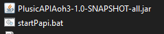

# Downloading and running

### To download **PlusicAPI** you need to go to the project repository git hub and download the necessary version from the [releases page](https://github.com/Mega4oSS/PlusicAPI/releases)

### In our case it will be Beta v1.0.1, so download it exactly

### We get the PlusicAPI-VERSION.7z archive which should be unpacked in any available way ( 7zip o.r WinRar ).

### Next we need to download [Java Corretto 11](https://docs.aws.amazon.com/corretto/latest/corretto-11-ug/downloads-list.html) or a higher version (Available for all OS)


## Windows

### And so, received from the archive files we need to transfer to the folder with the game (Where the game file aho3.exe | aoh3.jar)

### Among the unpacked files we need to find the file startPapi.bat

<figure><figcaption></figcaption></figure>

### This file executing command&#x20;

`java -jar PlusicAPIAoh3-1.0-SNAPSHOT-all.jar`


### If you have another Java version, change the  startPapi.bat, and change the line where


<pre data-full-width="true"><code><strong>"&#x3C;java_version>/bin/java.exe" -jar PlusicAPIAoh3-1.0-SNAPSHOT-all.jar
</strong></code></pre>


### Example:



```sh
"C:\Program Files\Amazon Corretto\jdk11.0.25_9\bin\java.exe" -jar PlusicAPIAoh3-1.0-SNAPSHOT-all.jar
```


### And launch the  startPapi.bat. The game will start automatically


## Linux (All distributions)

### PlusicAPI installation is the same as in Windows except for a few things.


### PlusicAPI does not yet officially contain the necessary file to run on Linux

### So we will create it ourselves, for this you need to create a file startPapi.sh, then similar to Windows (under the condition of finding Java on the system) write:


```
java -jar PlusicAPIAoh3-1.0-SNAPSHOT-all.jar
```
